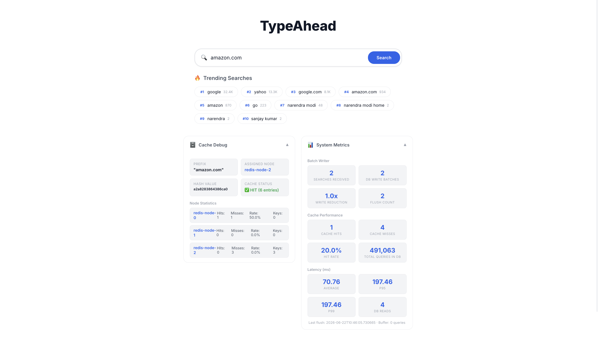
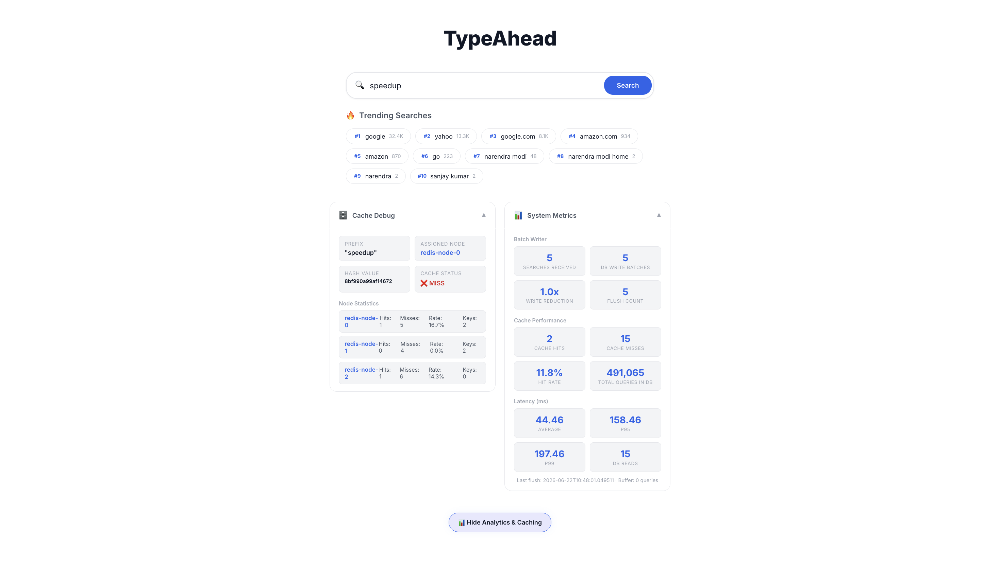

# 🔍 Search Typeahead System

A full-stack search typeahead application built with **Spring Boot**, **React**, **PostgreSQL**, and **Redis** — featuring distributed caching via consistent hashing, trending search ranking with exponential decay, and batch writes for write-pressure reduction.

## 🏗️ Architecture

```
Frontend (React + Vite :5173)
    ↕ REST API
Backend (Spring Boot :8080)
    ├── Consistent Hash Ring → Redis (3 logical nodes: DB 0, 1, 2)
    ├── Batch Writer → PostgreSQL (491K+ queries)
    └── Trending Engine (exponential decay, 24h window)
```

### Key Components

| Component | Technology | Purpose |
|-----------|-----------|---------|
| **Frontend** | React + Vite | Search UI, suggestion dropdown, trending chips, metrics dashboard |
| **Backend** | Spring Boot 3 (Java 17+) | REST APIs, business logic, scheduling |
| **Primary DB** | PostgreSQL 16 | Persistent storage for 491K+ queries |
| **Cache** | Redis 7 (3 logical databases) | Distributed suggestion cache with consistent hashing |

## 📸 Screenshots

### 1. Main Search & Typeahead Suggestions


### 2. Cache Routing & Debug Panel (Consistent Hashing)


### 3. System Metrics Dashboard


## 🚀 Quick Start

### Prerequisites
- Java 17+ (tested with Java 25)
- Node.js 18+
- Docker & Docker Compose

### 1. Start Infrastructure
```bash
docker compose up -d
```
This starts PostgreSQL (port 5432) and Redis (port 6379).

### 2. Start Backend
```bash
cd backend
./mvnw spring-boot:run
```
On first startup, the system automatically seeds **491,063 queries** across 5 categories (electronics, programming, general, shopping, how-to).

### 3. Start Frontend
```bash
cd frontend
npm install
npm run dev
```
Open http://localhost:5173

## 📡 API Documentation

| API | Method | Purpose | Example |
|-----|--------|---------|---------|
| `/api/suggest?q=<prefix>&trending=true` | GET | Fetch suggestions | `GET /api/suggest?q=iphone` |
| `/api/search` | POST | Submit search | `POST /api/search {"query": "iphone 15"}` |
| `/api/cache/debug?prefix=<prefix>` | GET | Debug cache routing | `GET /api/cache/debug?prefix=iph` |
| `/api/metrics` | GET | System metrics | `GET /api/metrics` |

### Response Examples

**Suggest API:**
```json
{
  "suggestions": [
    {"query": "iphone 15", "count": 287699, "trendingScore": 142110.34},
    {"query": "iphone 15 pro", "count": 207803, "trendingScore": 127981.72}
  ],
  "cached": true,
  "cacheNode": "redis-node-1",
  "latencyMs": 1.23
}
```

**Search API:**
```json
{"message": "Searched", "query": "iphone 15"}
```

**Cache Debug API:**
```json
{
  "prefix": "iph",
  "hashValue": "affae3125d23ab38",
  "assignedNode": "redis-node-1",
  "cacheHit": false,
  "allNodes": [
    {"id": "redis-node-0", "hits": 42, "misses": 18, "hitRate": 0.7, "keyCount": 35},
    {"id": "redis-node-1", "hits": 38, "misses": 22, "hitRate": 0.633, "keyCount": 30},
    {"id": "redis-node-2", "hits": 45, "misses": 15, "hitRate": 0.75, "keyCount": 38}
  ]
}
```

## 🧠 Design Choices & Trade-offs

### 1. Consistent Hashing for Redis Cache
- **Implementation**: MD5-based hash ring with 150 virtual nodes per physical node (450 total).
- **Why virtual nodes**: Prevents uneven key distribution when nodes are added/removed.
- **3 logical databases**: We use Redis databases 0, 1, 2 on a single Redis instance to simulate distributed nodes. In production, these would be separate Redis instances.
- **TTL**: 60-second expiry ensures stale data doesn't persist.

### 2. Trending Search Ranking (Exponential Decay)
- **Formula**: `score = 0.3 × all_time_count + 0.7 × recent_weighted_score`
- **Decay**: `recent_score = Σ(count × e^(-0.1 × age_hours))` — half-life ≈ 7 hours
- **Window**: 24-hour sliding window with 1-hour time buckets
- **Why this avoids permanent over-ranking**: Queries that were popular 12+ hours ago contribute negligibly due to exponential decay. The 24h window provides a hard cutoff.
- **Cache invalidation**: When trending scores change, affected cache entries are invalidated.
- **Scheduled job**: Runs every 15 minutes to clean expired buckets.
- **Immediate updates**: Query trending scores are calculated and saved in the database **instantly** during the batch write flush (every 5 seconds) to reflect user searches immediately.

### 3. Batch Writes
- **Buffer**: `ConcurrentHashMap<String, AtomicLong>` aggregating duplicate queries.
- **Flush triggers**: Every 5 seconds OR when buffer reaches 100 unique queries.
- **Reduction**: If 50 users search "iphone" in 5 seconds, only 1 DB write occurs (count += 50).
- **Failure trade-off**: If the app crashes before flush, buffered writes are lost. Mitigations:
  - Accept the trade-off (minor count inaccuracies in a demo).
  - In production: WAL to disk before acknowledging, or a durable message queue.

### 4. Zero-Entry Cache Invalidation (Negative Cache Misses)
- **Negative Caching**: Cache empty search results (`[]`) to prevent database hits for queries with no matches.
- **Real-time update logic**: If a cached result has 0 entries, we treat it as a Cache **MISS** in metrics and the UI debug panel. We fall back to the database to check if new results have been written since it was cached, and then update the Redis entry. This ensures that new submissions matching previously empty prefixes show up instantly while keeping database reads extremely low.

### 5. Frontend Debouncing
- 300ms debounce on search input to avoid excessive API calls.
- Keyboard navigation (↑↓ Enter Escape) for accessibility.
- Auto-refresh trending searches every 30 seconds.

## 📊 Performance

| Metric | Value |
|--------|-------|
| Dataset size | 491,063 queries |
| Seed time | ~13 seconds |
| Avg suggestion latency (cached) | < 2ms |
| Avg suggestion latency (uncached) | ~20ms |
| Cache TTL | 60 seconds |
| Batch flush interval | 5 seconds |
| Hash ring virtual nodes | 450 (150 × 3 nodes) |

> Use the `/api/metrics` endpoint or the Metrics Dashboard in the UI for live p95/p99 latency, cache hit rate, and write reduction ratio.

## 📁 Project Structure

```
HLD/
├── docker-compose.yml          # PostgreSQL + Redis
├── backend/
│   ├── pom.xml                 # Maven (Spring Boot 3.3.6)
│   └── src/main/java/com/typeahead/
│       ├── TypeaheadApplication.java
│       ├── controller/         # REST endpoints
│       ├── service/            # Business logic
│       ├── cache/              # Consistent hash ring + cache manager
│       ├── model/              # JPA entities
│       ├── repository/         # Spring Data JPA
│       ├── config/             # Redis, CORS, data seeder
│       └── dto/                # Request/response DTOs
├── frontend/
│   ├── vite.config.js
│   └── src/
│       ├── App.jsx             # Main layout
│       ├── index.css           # Design system (dark, glassmorphism)
│       ├── components/         # SearchBar, Suggestions, Trending, etc.
│       └── hooks/              # useDebounce
└── README.md
```

## 🎯 Features Checklist

- [x] **Typeahead suggestions** — 10 prefix-matching results sorted by count/trending
- [x] **Search submission** — POST /search returns "Searched" and updates counts
- [x] **Distributed cache** — Redis with consistent hashing (3 nodes, 450 virtual nodes)
- [x] **Trending searches** — Exponential decay with 24h sliding window
- [x] **Batch writes** — ConcurrentHashMap buffer with timer + size-based flush
- [x] **Debounced input** — 300ms debounce to reduce API calls
- [x] **Keyboard navigation** — ↑↓ Enter Escape support
- [x] **Cache debug API** — Shows hash routing, hit/miss, per-node stats
- [x] **Metrics API** — p50/p95/p99 latency, cache hit rate, write reduction
- [x] **491K+ query dataset** — Synthetic data with Zipf distribution
- [x] **Polished UI** — Dark glassmorphism theme with micro-animations
